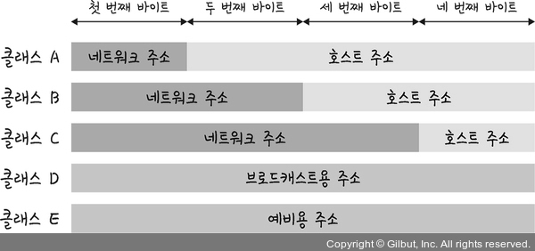

# IP 주소

## ARP (Address Resolution Protocol)

> IP 주소로부터 MAC 주소를 구하는 IP와 MAC 주소의 다리 역할을 하는 프로토콜

- 가상 주소인 IP 주소를 실제 주소인 MAC 주소로 변환

<br>


```markdown
💡 MAC 주소 (Media Access Control Address, 물리적 주소)

네트워크 세그먼트의 데이터 링크 계층 에서 통신을 위한 네트워크 인터페이스에 할당된 고유 식별자

이더넷과 와이파이를 포함한 대부분의 IEEE 802 네트워크 기술에 네트워크 주소로 사용
```


## IP 주소 체계

<br>


### 1. IPv4

- 32비트를 8비트 단위로 점을 찍어 표기 (123.45.67.89)
- 주소 길이 : 32비트
- 데이터가 정확하게 전달될 것을 보장하지 않고, 중복된 패킷을 전달하거나 패킷의 순서를 잘못 전달할 가능성 있음

#### # 클래스 기반 할당 방식 (IPv4 에서 아이피 주소 할당하는 방식)

- 클래스 : 하나의 IP 주소에서 네트워크 영역과 호스트 영역을 나누는 방법
- A, B, C, D, E 다섯개의 클래스로 구분
- 네트워크 주소 + 호스트 주소

<br>

 | 
--- | --- | 

- 클래스 A, B, C : 일대일 통신
- 클래스 D : 멀티캐스트 통신
- 클래스 E : 예비용 / 연구용

<br>

#### 단점

- IP 낭비 (IP 주소를 효율적으로 사용할 수 없음) ⇒ 해소 : DHCP, IPv6, NAT

<br>

### 2. IPv6

> 기존 32비트의 IPv4 주소가 고갈되는 문제를 해결하기 위하여 개발된 새로운 128비트 체계의 무제한 인터넷 프로토콜 주소

- 16비트 단위로 16진수로 점을 찍어 표기 (2001:db8::ff00:42:8329)
- 주소 길이 : 128비트

```markdown
// 모두 같은 주소를 나타냄
2001:0DB8:0000:0000:0000:0000:1428:57ab
2001:0DB8:0000:0000:0000::1428:57ab
2001:0DB8:0:0:0:0:1428:57ab
2001:0DB8:0::0:1428:57ab
2001:0DB8::1428:57ab
```

<br>

### 3. NAT (Network Address Translation, 네트워크 주소 변환)

> 패킷이 라우팅 장치를 통해 전송되는 동안 패킷의  IP 주소 정보를 수정하여 IP 주소를 다른 주소로 매핑하는 방법

- 여러 대의 호스트가 하나의 공인 IP 주소를 사용하여 인터넷에 접속하기 위한 경우 사용

<br>


- 내부 네트워크 정보 보안 기능 : 내부 네트워크에서 사용하는 IP 주소와 외부에 드러나는 주소를 다르게 유지

- 여러명이 동시에 접속하기 때문에 실제 접속한 호스트 숫자에 따라 접속 속도에 제한이 생김

<br>

#### 공인 IP

> 공유기가 인터넷과 통신하도록 하는 역할을 하는 외부 IP 주소

- ICANN이라는 기관이 국가별로 사용할 IP 대역을 관리하고, 우리나라는 한국인터넷진흥원(KISA)에서 국내 IP 주소들을 관리
- ISP(Internet Service Provide, 인터넷을 제공하는 통신업체)가 부여받고, 우리는 위 회사에 가입을 통해 IP를 제공받아 인터넷을 사용하게 됨

<br>

#### 사설 IP

> 한 네트워크 안에서만 내부적으로 사용되는 고유한 주소

- 로컬 네트워크에서 할당되며 다른 네트워크의 IP 주소와 중복될 수 있음
- 공유기를 사용한 인터넷 접속 환경일 경우 공유기까지는 공인 IP 할당을 하지만, 공유기에 연결되어 있는 가정이나 회사의 각 네트워크 기기에는 사설 IP를 할당

<br>

#### 차이점

- 공인 IP는 전세계에서 유일하며 접근에 제한이 없으나 사설 IP는 하나의 네트워크 안에서만 유일하며 외부에서 접근이 불가