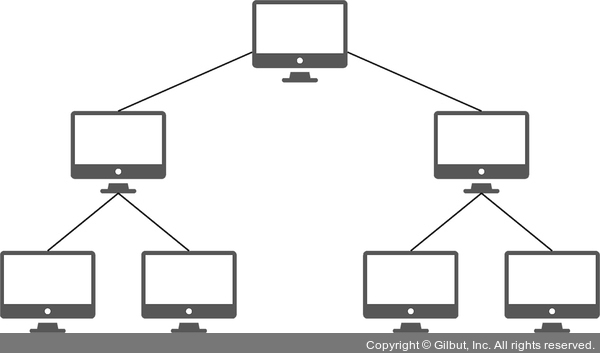

# **네트워크 토폴로지 (망 구성 방식)**

> 네트워크 요소(노드, 링크)들이 물리적으로 배치, 연결 되어있는 방식 / 형태

- **병목현상**을 찾는 경우 중요한 기준이 됨
- 트리형, 버스형, 성형, 링형, 망형

<br>

## **1. 트리형 (Tree)**

> 중앙 컴퓨터와 일정 지역의 단말장치까지는 하나의 통신회선으로 연결하고 이웃하는 단말장치는 일정 지역 내 설치된 중간 단말방치에서 다시 연결하는 구조

<br>



#### 장점

- 단말장치 (노드)의 추가, 삭제가 용이함

#### 단점

- 특정 노드에 트래픽 집중 시 하위 노드에 영향

<br>

## **2. 버스형 (Bus)**

> 중앙 통신 회선 하나에 여러 개의 노드가 연결되어 공유

<br>


#### 장점

- 물리적 구조가 단순함

- 단말장치 추가, 제거가 용이함

- 단말장치가 고장나도 통신망 전체에 영향을 주지 않음 → 신뢰성이 높음

#### 단점

- 기밀 보장 어려움
  
- 통신회선 길이 제한

<br>

**※ 스푸핑**


- LAN 상에서 스위칭 기능을 마비시키거나 속여서 특정 노드에 해당 패킷이 오도록 처리하는 것 (패킷을 가로채거나 방해함)


<br>

## **3. 성형 (Star)**

> 중앙에 중앙 컴퓨터가 있고 이를 중심으로 단말 장치들이 연결됨 (중앙 집중형)

<br>


#### 장점

- 단말장치 추가, 제거, 에러 발견 용이

- 포인트 투 포인트(Point to Point) 방식으로 회선 연결

- 각 단말장치들은 중앙컴퓨터를 통해 데이터 교환

- 단말장치(중앙 노드 x)에 장애가 발생할 경우 다른 노트에 끼치는 영향이 적음

#### 단점

- 중앙 노드에 장애가 발생하면 전체 네트워크에 영향을 미침 (전체 네트워크 사용 불가)

<br>

## **4. 링형 (Ring)**

> 서로 이웃하는 컴퓨터 / 단말장치들끼리 포인트 투 포인트 방식(고리 처럼)으로 연결

<br>


#### 장점

- 분산 및 집중제어 모두 가능

- 단방향 / 양방향 전송 가능

#### 단점

- 단말장치 추가 / 제거, 기밀보호가 어려움

- 전송지연이 발생할 수 있음

#### ※ 단방향 링 vs 양방향 링

- 단방향 링 : 컴퓨터, 통신회선, 단말장치 중 하나라도 고장나면 전체 통신망에 영향을 미침

- 양방향 링 : 노드에 이상이 생겼을 경우 다른 방향으로 우회 가능

<br>

## **5. 망형 (Mesh)**

> 모든 지점의 컴퓨터와 단말장치를 서로 연결 (그물망 처럼)

<br>


- 통신 회선의 총 경로가 가장 김

- 통신회선 장애 시 다른 경로로 데이터 전송

#### 장점

- 많은 단말 장치로부터 많은 양의 통신을 필요로 하는 경우 유리

- 보통 공중 데이터 통신망에서 사용

#### 단점

- 노드의 추가 / 제거가 어려움


---

# **네트워크 분류**

## **1. LAN(Local Area Network) : 근거리 통신망**
    
- 사이트 간 거리가 짧아 전송 속도가 빠르고 혼잡하지 않음
    
- 자원 공유 목적으로 사용되며 버스형 / 링형 구조 사용
    
```
예시) 회사, 학교, 연구소 등에서 비교적 가까운 거리에 있는 컴퓨터, 프린터 등과 같은 자원을 연결하여 구성
```

<br>

## **2. MAN(Metropolitan Area Network) : 대도시 지역 네트워크**
    
- 도시 같이 넓은 지역에서 운영됨
    
- 전송속도가 평균이며 LAN 보다 혼잡함

<br>

## **3. WAN(Wide Area Network) : 광역 네트워크**
    
- 사이트 간 거리가 멀기 때문에 전송 속도가 느리고 매우 혼잡함 + 에러 발생률이 높음!

- 일정 지역 사이트들을 근거리 통신망으로 연결한 후 각 근거리 통신망을 연결하는 방식을 사용